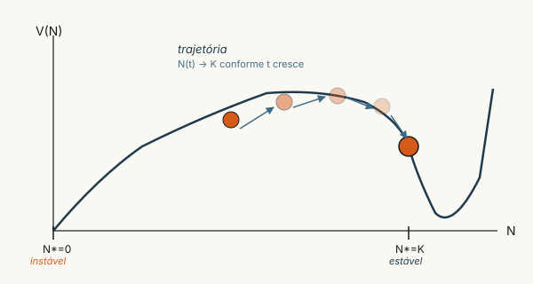
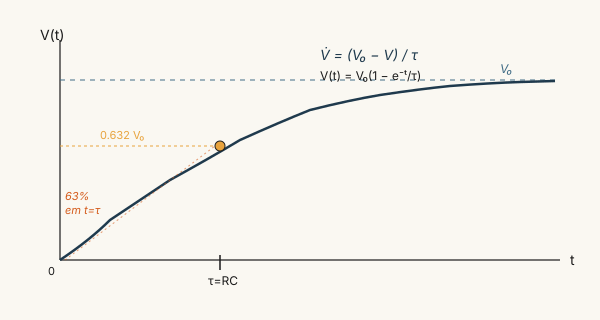
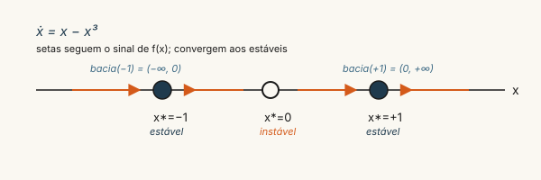

```{=html}
<div class="painel-opsroom">
  <div class="botao ativo"><span class="label">Semana</span><span class="valor">1 de 24</span></div>
  <div class="botao"><span class="label">Fase</span><span class="valor">Strogatz</span></div>
  <div class="botao"><span class="label">Tempo</span><span class="valor">60–90 min</span></div>
</div>
```

::: {.cena}
[]{.persona-tag .joana}**Joana, segunda-feira, 8h.**

Joana chegou ao polo da UAB-UNITINS em Augustinópolis com o caderno aberto na contagem de matrículas. A turma de Pedagogia que entrou em 2022 tinha 38 alunos. No quarto semestre, 22. No oitavo, projetava-se algo entre 12 e 15. A turma de 2023, com 41 ingressantes, parecia caminhar para 25 no quarto semestre — mais devagar.

Ela não procurava ainda uma fórmula. Procurava um padrão. *Existe um número de equilíbrio para cada polo? Uma turma que estabiliza vira "estável"? Uma que despenca colapsa para zero?*

Sentou-se na mesa da coordenação, anotou a pergunta no topo da página e começou a desenhar setas: matrícula → trancamento → reativação → conclusão → evasão. Foi o primeiro retrato de fase da vida dela.
:::

::: {.simples}
Pense numa caixa d'água com torneira aberta na entrada e ralo aberto na saída. Se entra mais água do que sai, o nível sobe. Se sai mais do que entra, desce. Em algum momento, se as duas torneiras ficam constantes, **o nível para de mexer** — não está vazio, não está cheio, está num ponto de equilíbrio. **Esse ponto é o que vamos estudar.**

A matemática do capítulo só formaliza essa intuição. Quem entender a caixa d'água já entendeu metade.
:::

## A pergunta operacional

A pergunta central da Fase 1 é geometricamente simples: dado um sistema autônomo de primeira ordem na reta, $\dot{x} = f(x)$, com $f$ suficientemente regular, o que é possível dizer sobre o comportamento de longo prazo de qualquer trajetória, sabendo apenas onde $f$ se anula e qual é o sinal de $f$ entre seus zeros? A resposta de @strogatz2018 é desproporcional à modéstia da pergunta: para a dinâmica unidimensional autônoma, *tudo o que importa* está nos zeros de $f$ (os pontos fixos) e na monotonicidade local de $f$ em torno deles.

A razão é topológica. Em um espaço de estados unidimensional, uma trajetória é uma curva monótona até atingir um ponto fixo ou divergir; não há laços fechados, não há oscilações sustentadas, não há caos. Esse fato — que parece pobre — funda toda a Fase 1: *é por ser pobre que é tratável*, e tratabilidade é a condição para que possamos depois reintroduzir, ordenadamente, complexidade.

```{=html}
<div class="cards-conceito">
  <div class="card-conceito">
    <h4>Ponto fixo</h4>
    <p>Estado <span class="formula">x*</span> em que <span class="formula">f(x*) = 0</span>. Sistema iniciado ali não se move.</p>
  </div>
  <div class="card-conceito">
    <h4>Estabilidade linear</h4>
    <p>Se <span class="formula">f'(x*) &lt; 0</span>: atrai. Se <span class="formula">f'(x*) &gt; 0</span>: repele. Se zero: degenerado.</p>
  </div>
  <div class="card-conceito">
    <h4>Bacia de atração</h4>
    <p>Conjunto de condições iniciais cujas trajetórias convergem para um <span class="formula">x*</span> estável.</p>
  </div>
  <div class="card-conceito">
    <h4>Potencial V(x)</h4>
    <p><span class="formula">V = -∫f</span>. Trajetórias descem o gradiente. Pontos fixos estáveis = mínimos locais.</p>
  </div>
</div>
```

## Pontos fixos e estabilidade linear

Um **ponto fixo** $x^*$ de $\dot{x}=f(x)$ é um zero de $f$, isto é, $f(x^*)=0$. Iniciado em $x^*$, o sistema permanece em $x^*$ para todo $t \geq 0$. A questão delicada é: iniciado *próximo* a $x^*$, o sistema retorna ou se afasta?

A resposta é dada pela **análise de estabilidade linear**. Expandindo $f$ em série de Taylor em torno de $x^*$,

$$
\dot{x} \;=\; f(x^*) + f'(x^*)(x-x^*) + O\big((x-x^*)^2\big) \;=\; f'(x^*)\,\eta + O(\eta^2),
$$

com $\eta := x - x^*$, e desprezando os termos de ordem superior, obtém-se a equação linear $\dot{\eta} = f'(x^*)\,\eta$, cuja solução é exponencial: $\eta(t) = \eta(0)\,e^{f'(x^*)t}$. Daí o critério:

$$
\boxed{\;f'(x^*) < 0 \;\Rightarrow\; x^*\text{ estável};\qquad f'(x^*) > 0 \;\Rightarrow\; x^*\text{ instável}.\;}
$$ {#eq-estab-linear}

O caso $f'(x^*)=0$ é degenerado e exige análise não-linear. Geometricamente: se $f$ cruza o eixo $x$ descendo no zero $x^*$, então $f$ é positiva à esquerda (sistema vai para a direita) e negativa à direita (sistema vai para a esquerda) — atrai. Se $f$ cruza subindo, repele.

## Existência e unicidade (Picard)

Antes de tratar comportamento de longo prazo, é prudente garantir que as soluções existem e são únicas. O **teorema de Picard-Lindelöf** estabelece que, se $f$ é Lipschitz contínua em uma vizinhança de $x_0$, o problema de Cauchy

$$
\dot{x} = f(x), \qquad x(t_0) = x_0,
$$

admite solução única em algum intervalo de tempo aberto contendo $t_0$. A consequência operacional é forte: **trajetórias não se cruzam**. Em 1D, isso já força o comportamento monótono — duas trajetórias que se cruzassem violariam a unicidade de Picard.

## O potencial $V(x)$ e a interpretação energética

A função $V(x) := -\int^x f(s)\,ds$ define um **potencial fictício** sobre o espaço de estados. Pela definição, $\dot{x} = f(x) = -V'(x)$, ou seja, o sistema desce o gradiente de $V$. Pontos fixos estáveis correspondem a mínimos locais; instáveis, a máximos. A "bacia de atração" do dinamicismo é literalmente uma bacia do potencial.

{#fig-bacia-potencial fig-alt="Gráfico do potencial V(N) com bola descendo até o mínimo local em N igual a K"}

## Voz dos personagens

```{=html}
<div class="dialogo">
  <div class="fala joana">
    <div class="quem">Joana</div>
    <div class="o-que">Então a "turma estável" do polo de Augustinópolis seria um ponto fixo?</div>
  </div>
  <div class="fala juliana">
    <div class="quem">Juliana</div>
    <div class="o-que">Estável <em>se</em> o número de matrículas e a taxa de evasão estiverem em equilíbrio. Mas observa: equilíbrio não é o mesmo que sucesso pedagógico. Um polo pode ter ponto fixo estável de 12 alunos e estar à beira do encerramento administrativo.</div>
  </div>
  <div class="fala luiz">
    <div class="quem">Luiz Eduardo</div>
    <div class="o-que">É a mesma matemática que a saturação de pixel no sensor de uma câmera. Você ilumina mais e mais, e em algum momento o pixel fica branco e para de responder. Ponto fixo. A diferença é que aqui a saturação é boa para a foto e ruim para a coordenação.</div>
  </div>
</div>
```

## Exemplos canônicos

### Modelo logístico (Verhulst)

$\dot{N} = r\,N\!\left(1 - N/K\right)$, com $r,K > 0$. Pontos fixos: $N^* = 0$ (instável, $f'=r>0$) e $N^* = K$ (estável, $f'=-r<0$). A bacia de atração de $K$ é $(0, \infty)$. Tempo característico: $\sim 1/r$. Modelo canônico de **capacidade de carga** — cresce exponencialmente longe do limite, satura próximo a ele.

### Carregamento RC

$\dot{V} = (V_0 - V)/\tau$, com $\tau = RC$. Único ponto fixo $V^* = V_0$, globalmente estável. Solução explícita: $V(t) = V_0 + (V(0) - V_0)\,e^{-t/\tau}$. O tempo característico $\tau = |f'(x^*)|^{-1}$ é o **tempo de meia-vida** local da perturbação.

{#fig-rc-charging fig-alt="Curva exponencial crescente saturando em V0 com marcação de tau"}

### Polo UAB-UNITINS de Augustinópolis (aplicação institucional)

Considere $S(t)$ = número de estudantes ativos no polo num dado instante. Em modelagem agregada (capítulo F3-01), o balanço aproxima-se por

$$
\dot{S} = i(t) - \frac{S}{\tau_{\text{permanência}}},
$$

onde $i(t)$ é o fluxo de novas matrículas e $\tau_{\text{permanência}}$ é o tempo médio que um estudante permanece ativo. Em regime estacionário com $i$ constante: $S^* = i\,\tau_{\text{permanência}}$, estável com tempo característico $\tau_{\text{permanência}}$. **Forma RC aplicada à demografia institucional.** O sistema filtra distúrbios com banda passante $1/\tau$. Para Joana: comparar polos UAB-UNITINS de Augustinópolis e Dianópolis pelo $\tau$ estimado é o primeiro passo de diagnóstico — polos com $\tau$ pequeno (alta evasão) e polos com $\tau$ grande (baixa rotatividade) operam em regimes dinâmicos qualitativamente diferentes.

## Conexão com Ashby/Beer

Em linguagem cibernética, um ponto fixo estável é a definição rigorosa de **homeostase**: estado para o qual o sistema retorna após perturbações pequenas. A bacia de atração delimita o conjunto de distúrbios que o sistema absorve sem mudar de regime — uma instância concreta da entropia $H(D)$ que aparecerá em F4-01. O critério $|f'(x^*)|$ mede a *taxa* de absorção; a recíproca, $1/|f'(x^*)|$, mede o *tempo* de absorção. Em VSM (capítulo F4-01), esse tempo característico é o que limita a banda passante de S2 (antioscilação) e S3 (alocação aqui-agora): se um distúrbio chega mais rápido do que $\tau = 1/|f'|$, o regulador simplesmente não tem tempo de responder.

::: {.callout-important}
A diferença entre "regulador com variedade requisita" e "regulador rápido o suficiente" é o que separa o desenho institucional bom no papel do desenho institucional que funciona na prática.
:::

```{=html}
<div class="hex-divisor">
  <span class="hex"></span>
  <span class="hex"></span>
  <span class="hex"></span>
</div>
```

## Pergunta de verificação

{#fig-retrato-fase-1d fig-alt="Eixo horizontal com três pontos fixos marcados: x igual a menos um, zero e mais um, com setas convergindo aos extremos"}

Para o sistema $\dot{x} = x - x^3$:

1. Encontre todos os pontos fixos. (Três; @fig-retrato-fase-1d antecipa.)
2. Classifique cada um via @eq-estab-linear.
3. Verifique o retrato de fase contra @fig-retrato-fase-1d.
4. Identifique a bacia de atração de cada ponto fixo estável.
5. Calcule o potencial $V(x)$ e confirme que pontos fixos estáveis são mínimos locais.
6. Em linguagem cibernética: qual o "regulador implícito" e qual sua "variedade requisita"?

::: {.callout-tip}
Importe o deck Anki (vide [revisão](../../revisao/index.qmd)) — os cartões `strogatz fase1` cobrem precisamente os conceitos deste capítulo. Quinze minutos diários por seis dias na semana, e a Fase 1 inteira fica fixada.
:::

```{=html}
<div class="proximo-passo">
  <h4>Próxima parada</h4>
  <strong>Semana 2 — Bifurcações em 1D</strong><br>
  <span style="opacity:0.8">O que acontece quando um parâmetro muda e a topologia colapsa?</span><br>
  <a href="../02-bifurcacoes-1d/intro.html">Continuar →</a>
</div>
```
